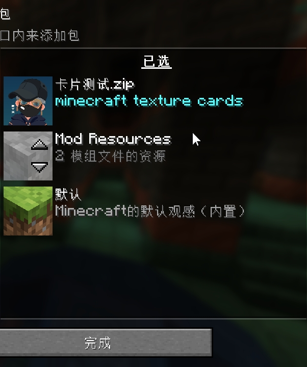
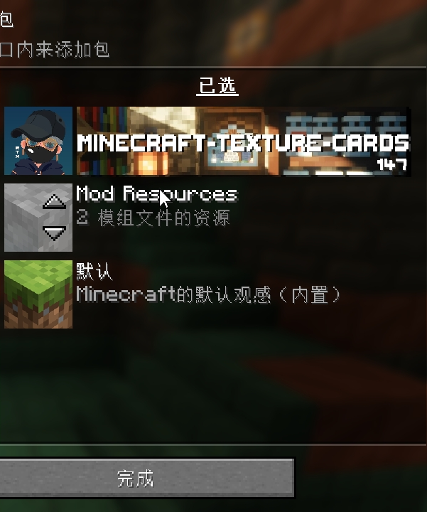
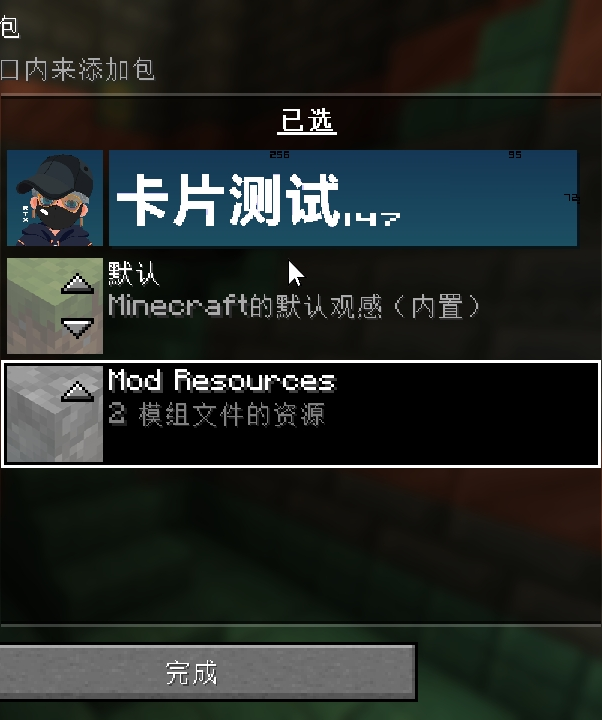
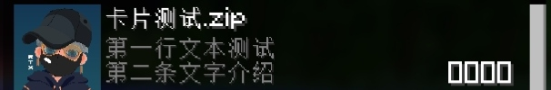
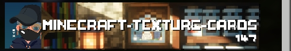

# 我的世界材质包卡片
# [中文](./README.zh-CN.md)/[English](./README.en-US.md)
你还在用这种看起来老式的文本描述吗？  
  
不妨来试试这种卡片式的,你既可以让它变成风景，也可以让它变成一张名片  
  
  

# 临时注意事项  
###### 由于教程还未编辑完成所以临时写出注意事项,以下的注意事项都是临时的,随时可能面临改动
### 1
如果你发现你的卡片变成了这样  
  
那么请不要慌张,这是正常现象这是因为处于未装载状态,需要装载后才会正常显示卡片  
###### 如果你有什么方法可以在不装载时显示卡片欢迎提交PR,或者邮件联系我
### 2
在[材质包信息文件](Repository/Resource_Pack/pack.mcmeta)  
```json
{
  "pack":{
    "pack_format":15,
    "supported_formats":[1, 64],
    "min_format":1,
    "max_format":147,
    "description":"第一行文本测试\n一二三四五六七八九十一二三四§f\ue145\ue146\ue147\ue148"
  }
}
#RTX1R7
```
中
```md
`\n`和`§f\ue145\ue146\ue147\ue148`
```
是必须改动的但改动方式在[点击跳转4](#4)
其他的请随意,包括这一段  
```md
`第一行文本测试`
```
可以改成你想显示的介绍话语但需要遵守[点击跳转到第3节](#3)
```md
`一二三四五六七八九十一二三四`
```
的修改方式在[点击跳转8](#8)
### 3
请确保你的介绍话语绝对没有像这样,超过第一行，来到第二行   
  
否则会出现显示错误    
  
↑像这样写满第一行时请用`\n`  
如果未写满第一行需要使用`\n`换行
但通常来说在[点击跳转2](#2)中已经要求你保留了
### 4
在[字符替换文件](Repository/Resource_Pack/assets/minecraft/font/default.json)
```json
{
 "providers":
  [
   {
   "type":"bitmap",
   "file":"minecraft:147/146.png",
   "ascent":28,
   "height":32,
   "chars": ["\ue146"]},
   {
   "type":"bitmap",
   "file":"minecraft:147/148.png",
   "ascent":28,
   "height":32,
   "chars": ["\ue148"]},
   {
   "type": "space",
   "advances":{"\ue147": -1.17}},
   {
   "type": "space",
   "advances":{"\ue145": -126}}
  ]
}
```
中的  
```md
`\ue146`和`\ue148`
```
是项目应用到你的材质上是必须改动的,但改动必须遵守以下规则,否则会出现错误,甚至无法装载  
1.不得继续使用`\ue146`和`\ue148`  
2.改名只能改动`\ue`之后的数字部分,最高三位数不得超过,也不能小于三位数  
3.如果你有其他材质,请不要与其他材质上的名一样,否则同时装载时会出现错误   
4.在`\ue`改名填写只可以包含以下内容`0-1`和`a-f`和`A-F`[字母加数字`\uea6f`][纯数字`\ue198`][纯字母(可以纯大写或纯小写)`\ueabc`][大写加小写`\ueAbC`]都是可以的  
5.`\ue146`和`\ue148`改动后不可相同如`\ue146`和`\ue148`改为`\ue777`和`\ue777`则不行  
6.改动后需要一同改动[材质包信息文件](Repository/Resource_Pack/pack.mcmeta)  
中的`\ue146`和`\ue148`但不一样的是你在[字符替换文件](Repository/Resource_Pack/assets/minecraft/font/default.json)中改的叫什么这里的就应该同步叫什么  
### 5
[卡片图片146.png](Repository/Resource_Pack/assets/minecraft/textures/147/146.png)的像素是-长边256-短边72  
[卡片图片148.png](Repository/Resource_Pack/assets/minecraft/textures/147/148.png)的像素是-长边80-短边72  
### 6
像素多了少了都会影响图片显示  
### 7  
他们合起来是一张125+80比72的图片，可以根据这个来制作你的卡片  
### 8
第二行介绍文本后面的四个方块在这一行的最后  
假设你将其改为`第二条文字介绍`  
  
我们可以看到第二行文本部分并没有占满所有可用位置，我们需要在他后面添加空格来使方块置于这一行的最后，但是并不知道需要添加多少空格则可以用这个方法计算↓  
  
第二行中有七个汉字  
根据表格↓  
初始数=126  
汉字=9  
字母=6  
`-`=6  
`_`=6  
全角空格`　`=9  
普通空格(也就是你键盘上的空格)` `=4  
经过§l加粗后的  
汉字=9.5  
字母=7  
可以得出  
1.首先计算单位  
126-9*7=63  
2.然后计算需要多少个空格  
63÷9=7  
3.可知我们需要在第二行文字的后面方块的前面添加七个全角空格  
然后就可以得到正确的效果了↓  
  
注意  
1.不论是什么空格绝对不能连续打下23个空格，否则会被我的世界判定为[空]  
2.不可以将空格打多或打少,如果方块的位置不对会出现显示错误的问题如卡片位置过前,卡片不显示
  
  
3.你可以使用表格以外的符号,但是我不能保证它所对应表格上的数字,从而做出正确的计算  
4.所以我还是建议不要使用斜体等其他如`§l`那样改变字体的`§`编码(但改变颜色的`§`编码可以如`§b`可以用)表格以外的字符不建议使用


#### 很抱歉项目才刚开始还没有完善-_-ll
###### (可以先问候作者让他先教你😋) 
